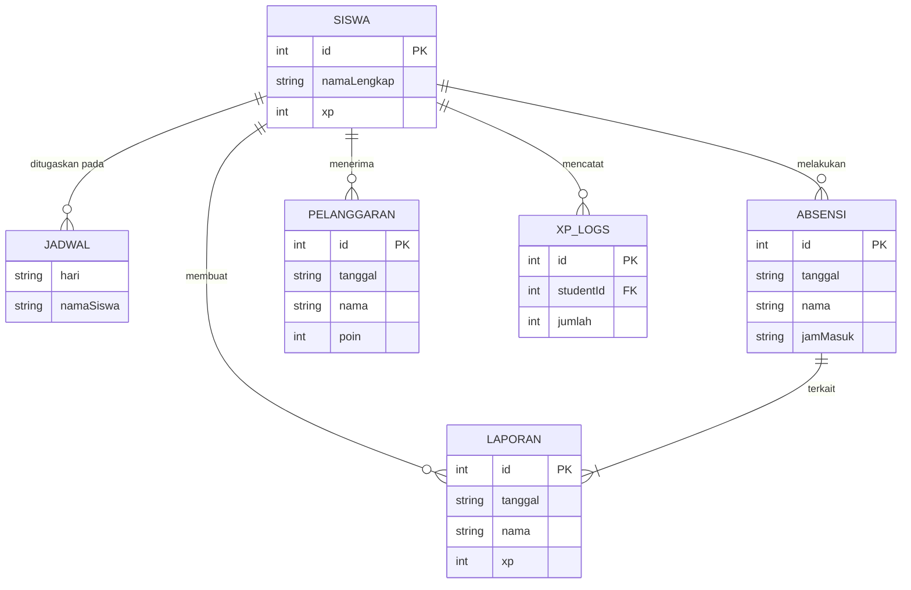

# 🗄️ Dokumentasi Database (Google Sheets)

<a href="./README.md">Dokumentasi</a> / Database

Dokumen ini menjelaskan struktur, skema, dan relasi dari database aplikasi yang diimplementasikan menggunakan Google Sheets. Setiap *sheet* dalam workbook utama berfungsi sebagai sebuah tabel.

## 📜 Daftar Isi
- [Gambaran Umum](#-gambaran-umum)
- [Relasi Antar Tabel](#-relasi-antar-tabel)
- [Skema Tabel](#-skema-tabel)
  - [1. SISWA](#1-siswa)
  - [2. JADWAL](#2-jadwal)
  - [3. ABSENSI](#3-absensi)
  - [4. LAPORAN](#4-laporan)
  - [5. PELANGGARAN](#5-pelanggaran)
  - [6. XP_LOGS](#6-xp_logs)
  - [7. ACTIVITY_LOG (Implisit)](#7-activity_log-implisit)
- [Contoh Query (Google Apps Script)](#-contoh-query-google-apps-script)

---

## 🖼️ Gambaran Umum
Database sistem ini menggunakan Google Sheets sebagai penyimpan data utama. Pendekatan ini memungkinkan admin (Guru atau pengurus kelas) untuk melihat, mengedit, dan mengelola data secara langsung melalui antarmuka spreadsheet yang familiar, sementara aplikasi tetap dapat berinteraksi secara terprogram melalui Google Apps Script.

- **Workbook**: Satu file Google Spreadsheet utama berisi semua data.
- **Tabel**: Setiap *sheet* di dalam *workbook* merepresentasikan satu tabel.
- **Primary Key**: Setiap baris umumnya memiliki kolom `id` yang unik sebagai *primary key*, meskipun ini dikelola di level aplikasi.
- **Relasi**: Relasi antar tabel diimplementasikan dengan menyimpan data denormalisasi (seperti `namaLengkap` siswa) di beberapa tabel untuk mengurangi kompleksitas *query*.

## 🔗 Relasi Antar Tabel
Berikut adalah diagram sederhana yang menggambarkan relasi antar tabel utama:



## 📋 Skema Tabel

### 1. SISWA
Menyimpan data master untuk setiap siswa di kelas X-E8.

| Field | Tipe Data | Deskripsi | Contoh Data |
| :--- | :--- | :--- | :--- |
| `id` | `number` | ID unik untuk setiap siswa. | `23` |
| `nama` | `string` | Nama panggilan siswa. | `"Ardellio"` |
| `namaLengkap` | `string` | Nama lengkap siswa, digunakan sebagai kunci relasi. | `"Ardellio Satria Anindito"` |
| `foto` | `string` | URL ke foto avatar siswa. | `"https://ui-avatars.com/..."` |
| `hariPiket` | `string` | Hari piket reguler siswa. | `"Kamis"` |
| `password` | `string` | Password untuk login (disimpan sebagai teks biasa). | `"ardellio"` |
| `xp` | `number` | Total poin pengalaman (XP) yang dimiliki siswa. | `1250` |
| `level` | `number` | Level siswa berdasarkan total XP. | `12` |
| `rank` | `number` | Peringkat siswa di leaderboard. | `1` |
| `status` | `'Aktif' \| 'Nonaktif'` | Status keaktifan siswa. | `"Aktif"` |

### 2. JADWAL
Menyimpan jadwal piket mingguan. Strukturnya adalah *key-value*, di mana *key* adalah nama hari.

| Field | Tipe Data | Deskripsi | Contoh Data |
| :--- | :--- | :--- | :--- |
| `Senin` | `string[]` | Array berisi nama lengkap siswa yang piket hari Senin. | `["Gisella Anastasya", ...]` |
| `Selasa` | `string[]` | Array berisi nama lengkap siswa yang piket hari Selasa. | `["Fahrul Hakim", ...]` |
| `...` | `...` | ...dan seterusnya untuk semua hari sekolah. | |

### 3. ABSENSI
Mencatat setiap kali siswa melakukan absensi piket (masuk dan keluar).

| Field | Tipe Data | Deskripsi | Contoh Data |
| :--- | :--- | :--- | :--- |
| `id` | `number` | ID unik untuk setiap entri absensi. | `1` |
| `tanggal` | `string` | Tanggal absensi dalam format `YYYY-MM-DD`. | `"2025-10-06"` |
| `nama` | `string` | Nama lengkap siswa yang melakukan absensi. | `"Ardellio Satria Anindito"` |
| `jamMasuk` | `string` | Waktu saat siswa melakukan absensi masuk. | `"14:35"` |
| `jamKeluar` | `string \| null` | Waktu saat siswa absen keluar. `null` jika belum. | `"15:02"` |
| `durasi` | `number \| null` | Durasi piket dalam menit. | `27` |
| `fotoUrl` | `string` | URL ke foto siswa saat absensi. | `"https://ui-avatars.com/..."` |
| `verified` | `boolean` | Status verifikasi oleh admin. | `true` |

### 4. LAPORAN
Menyimpan laporan detail pekerjaan piket yang dikirim oleh siswa.

| Field | Tipe Data | Deskripsi | Contoh Data |
| :--- | :--- | :--- | :--- |
| `id` | `number` | ID unik untuk setiap laporan. | `101` |
| `tanggal` | `string` | Tanggal laporan dibuat (`YYYY-MM-DD`). | `"2025-10-06"` |
| `nama` | `string` | Nama lengkap siswa yang membuat laporan. | `"Ardellio Satria Anindito"` |
| `rating` | `LaporanRating` | Objek berisi rating (1-5) untuk setiap tugas. | `{"lantai": 5, "papanTulis": 4, ...}` |
| `avgRating` | `number` | Rating rata-rata dari semua tugas. | `4.5` |
| `tasks` | `{[key: string]: boolean}` | Objek yang menandai tugas mana yang selesai. | `{"Sapu lantai": true, ...}` |
| `catatan` | `string` | Catatan tambahan dari siswa. | `"Semua bersih dan rapi."` |
| `fotoBukti` | `string[]` | Array URL ke foto bukti pekerjaan. | `["https://picsum.photos/..."]` |
| `xp` | `number` | Jumlah XP yang didapat dari laporan ini. | `67` |
| `verified` | `boolean` | Apakah laporan sudah diverifikasi oleh admin. | `true` |
| `verifiedBy` | `string` | Nama admin yang melakukan verifikasi. | `"Ardellio Satria Anindito"` |
| `status` | `'draft' \| 'submitted'` | Status laporan. | `"submitted"` |

### 5. PELANGGARAN
Mencatat semua pelanggaran yang dilakukan siswa terkait piket.

| Field | Tipe Data | Deskripsi | Contoh Data |
| :--- | :--- | :--- | :--- |
| `id` | `number` | ID unik untuk setiap pelanggaran. | `1` |
| `tanggal` | `string` | Tanggal pelanggaran dicatat (`YYYY-MM-DD`). | `"2025-10-01"` |
| `nama` | `string` | Nama lengkap siswa yang melanggar. | `"Pandu Wijaya"` |
| `jenisPelanggaran` | `PelanggaranJenis` | Tipe pelanggaran yang dilakukan. | `"Tidak piket"` |
| `poin` | `number` | Poin penalti yang diberikan. | `10` |
| `sanksi` | `string` | Sanksi yang harus dijalankan. | `"Piket 2x lipat minggu depan"` |
| `status` | `'Proses' \| 'Selesai'` | Status penyelesaian sanksi. | `"Proses"` |
| `verifiedBy` | `string` | Nama admin yang mencatat pelanggaran. | `"Novita Ayu"` |

### 6. XP_LOGS
Berfungsi sebagai *ledger* atau buku besar yang mencatat semua perubahan XP.

| Field | Tipe Data | Deskripsi | Contoh Data |
| :--- | :--- | :--- | :--- |
| `id` | `number` | ID unik untuk setiap log. | `201` |
| `studentId` | `number` | ID siswa yang menerima/kehilangan XP. (Foreign Key ke `SISWA.id`) | `23` |
| `tanggal` | `string` | Tanggal transaksi XP (`YYYY-MM-DD`). | `"2025-10-06"` |
| `jumlah` | `number` | Jumlah XP yang ditambahkan (bisa negatif). | `67` |
| `alasan` | `string` | Alasan transaksi XP. | `"Laporan Piket"` |

### 7. ACTIVITY_LOG (Implisit)
Tabel ini tidak ada secara eksplisit di Google Sheets, tetapi datanya dapat ditarik dari tabel lain untuk menampilkan riwayat aktivitas. Contohnya, gabungan dari `ABSENSI`, `LAPORAN`, dan `PELANGGARAN` dapat membentuk log aktivitas seorang siswa.

## 💡 Contoh Query (Google Apps Script)
Karena kita tidak menggunakan SQL, berikut adalah contoh bagaimana kita bisa mendapatkan data dari Google Sheets menggunakan Google Apps Script.

**Tujuan**: Dapatkan semua data absensi untuk siswa "Ardellio Satria Anindito".
**SQL Ekuivalen**: `SELECT * FROM ABSENSI WHERE nama = 'Ardellio Satria Anindito';`

**Implementasi di Google Apps Script (`Code.gs`):**
```javascript
function getAbsensiByNama(namaSiswa) {
  // Buka spreadsheet berdasarkan ID dan dapatkan sheet 'ABSENSI'
  const sheet = SpreadsheetApp.getActiveSpreadsheet().getSheetByName('ABSENSI');

  // Dapatkan semua data dari sheet (dalam bentuk array 2D)
  const data = sheet.getDataRange().getValues();

  // Dapatkan baris header untuk mengetahui indeks kolom
  const headers = data.shift(); // Hapus dan simpan baris pertama
  const namaColumnIndex = headers.indexOf('nama');

  // Filter data untuk menemukan baris yang cocok
  const result = data.filter(row => {
    return row[namaColumnIndex] === namaSiswa;
  });

  // Ubah array 2D menjadi array objek agar lebih mudah digunakan
  const objects = result.map(row => {
    let obj = {};
    headers.forEach((header, index) => {
      obj[header] = row[index];
    });
    return obj;
  });

  return objects;
}

// Contoh pemanggilan fungsi
// var ardellioAbsensi = getAbsensiByNama('Ardellio Satria Anindito');
// Logger.log(ardellioAbsensi);
```

---
*Terakhir diperbarui: 7 Oktober 2025*